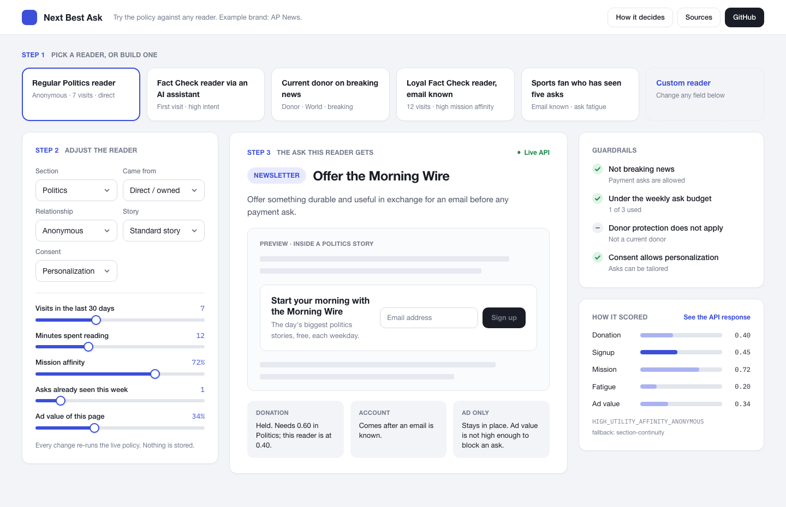
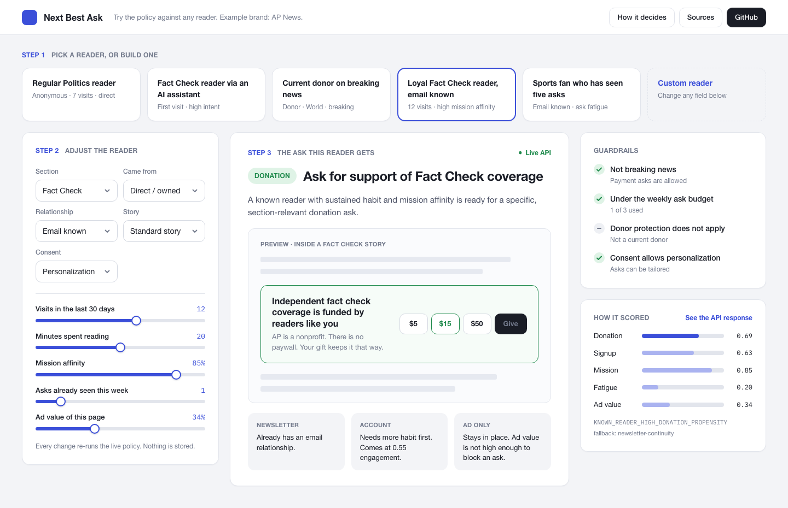
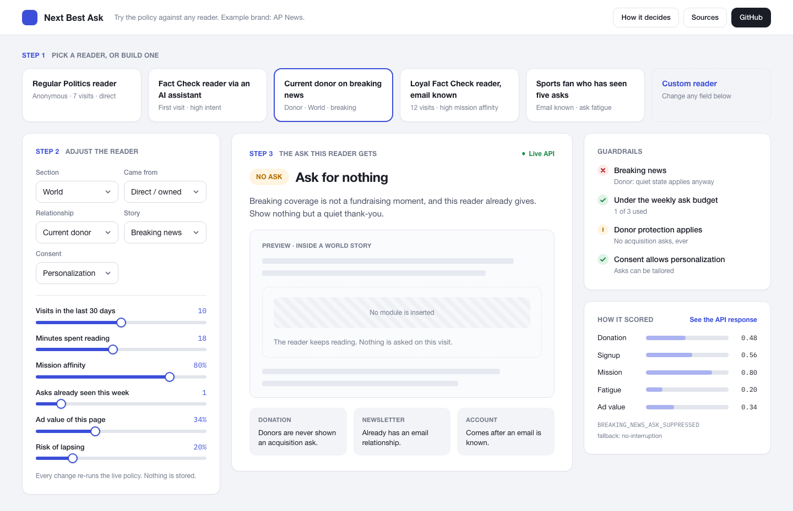
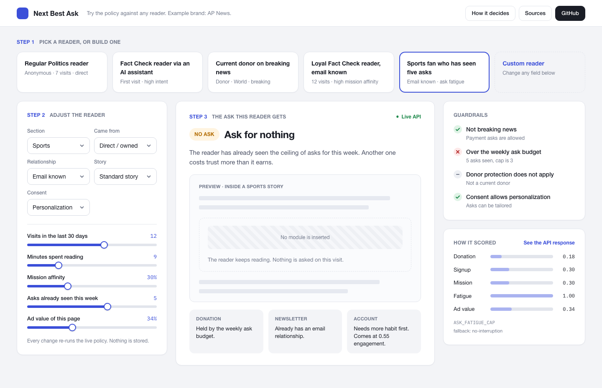

# Next Best Ask

**Live:** https://next-best-ask-production.up.railway.app

A small policy service that picks one ask per reader, per visit, for a newsroom that runs on reader support, and explains why it picked it. AP News is the example brand. Everything here is built from public pages and invented numbers. No internal data.

**Built for:** reader revenue, audience, and product data teams
**My role:** the thesis, the policy, the API, the interface

## The problem I kept running into

On a reader-supported news site, four teams can each own an ask. Newsletter owns the sign-up prompt. Audience owns the account prompt. Mobile owns the app banner. Development owns the donation module. Each ask is reasonable on its own. A reader who hits all four on one visit does not experience four reasonable asks. They experience noise, and they learn to ignore all of it.

I wanted to see what it would take to decide these together. One request in, one ask out, with a reason attached that a fundraiser, an editor, and an engineer could all argue with.

## What it does



You pick a reader, or build one, and the policy shows you what that reader would see on the page: the actual module rendered inside a mock story, the reason it won, and why the other asks lost.

The policy has three parts, and they run in this order.

Guardrails come first and they can veto anything. No payment ask during breaking news. No more than three asks in a week. Never an acquisition ask to someone who already gives. If a guardrail fires, the scores do not matter.

Then it scores the reader on two things: how likely they are to give, and how likely they are to sign up for something free. Those scores use visits, time spent, mission affinity, where the reader came from, and how many asks they have already seen.

Then it applies the section's own rules. A Fact Check reader and a Sports reader arrive for different reasons, so the thresholds and the default first ask differ by section.

## Walk through it

The five presets are the cases I used to argue with myself while writing the policy.

**Regular Politics reader, anonymous.** Seven visits, decent affinity, no relationship on record. The policy offers the Morning Wire and holds the donation ask. Donation would need 0.60 here; this reader scores 0.40. This is the most common case and the whole thesis in one screen: earn an email before you ask for money.

**Fact Check reader arriving from an AI assistant.** First visit, but high intent on the referring surface. The policy treats the arrival itself as the signal and offers a first-party relationship right away, because an assistant referral is rare and a generic prompt wastes it.



**Loyal Fact Check reader, email known.** Twelve visits, strong affinity, and AP already has the email. Now the donation ask is the right call, and the module says what the money funds instead of just asking for it.



**Current donor on breaking news.** Two guardrails fire at once. Breaking news suppresses payment asks, and donors never see an acquisition ask anyway. The reader gets nothing, and the panel on the right says so in plain language. I think this is the most important screen in the lab. The moment with the most traffic is the worst moment to fundraise, and the person most likely to be annoyed is the one who already gave.



**Sports fan who has seen five asks.** The weekly budget is three. Nothing else about this reader matters until next week.

Every preset has a link, so you can send someone straight to a case: add `?reader=donor-breaking` (or `politics-regular`, `factcheck-assistant`, `factcheck-loyal`, `sports-fatigued`) to the live URL.

## How I would use this

The lab is a conversation tool. Put it in front of a fundraiser and a newsletter editor at the same time and change one slider. The disagreement that follows is the product requirement.

The API behind it is the real deliverable. `POST /api/decision` takes a reader context and returns the action, the treatment, a reason code, a fallback, an experiment cell, the scores, and a seven-step trace. That contract is what would let four teams keep their own systems while sharing one decision and one exposure event.

```json
{
  "section": "fact-check",
  "identity": "known",
  "consent": "personalization",
  "origin": "ai-assistant",
  "storyMode": "standard",
  "visits30d": 12,
  "engagedMinutes": 20,
  "partnerEngagement": 0.8,
  "missionAffinity": 0.85,
  "adValue": 0.3,
  "asksSeen7d": 1,
  "lapseRisk": 0.1
}
```

Actions are `signup`, `account`, `app`, `donation`, `sustain`, `steward`, `winback`, `alerts`, `advertising`, or `quiet`.

## Run it locally

Node 20 or later.

```bash
npm install
npm run dev        # http://127.0.0.1:5173
npm run check      # policy tests, TypeScript, production build
```

## What remains unproven

This shows the contract and the guardrails. It does not show that coordinating asks raises donations or sign-ups. The weights in the scoring are my judgment, not fitted to anything. The section thresholds are a starting argument, not a result.

## Next step

One section, one cell that only asks known readers with a mission signal, one clean holdout. Track gifts per thousand known sessions, unsubscribe rate, and how often a current donor gets shown an ask by mistake. That last number should be treated like an outage.

## Where the claims come from

Every claim in the app is labeled. Observed means I saw it on a public apnews.com or ap.org page in September 2026: the donate page, the Morning Wire and Afternoon Wire, sign-in, the apps. Public means AP or a named third party said it in a public source. Proposed means it is my idea. The sources section in the app links each one.

## Related

[Growth Room](https://github.com/thebryandavis/growth-room-lab) is the companion. Next Best Ask decides what one reader sees. Growth Room is where a team decides what the policy should test next.

Independent portfolio work by Bryan Davis. Not an AP product.
