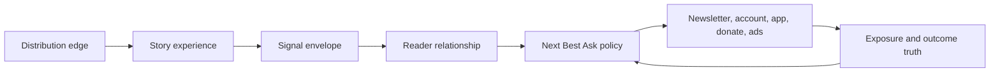

# Next Best Ask

An explainable decision layer for donations and first-party sign-ups at a nonprofit newsroom, prototyped against public apnews.com signals.

**Built for:** Reader revenue, audience and product data teams at mission-funded news organizations
**My role:** Product thesis, decision policy, API, interface and public-signal audit

## What I was trying to learn

When one reader lands on one story, which single ask is right: a newsletter, an account, the app, a donation, or nothing? And can that decision be explained well enough that an editor, a fundraiser and an engineer would all accept it?

## What I built

- An editorial brief that states the thesis: for a nonprofit newsroom, the ask is a trust event, so first-party relationship comes before support.
- A live decision lab across four AP sections (Politics, World, Fact Check, Sports) and six discovery origins (direct, search, social video, aggregators, AI assistants, member sites).
- A working `POST /api/decision` microservice with validation, section policy, hard guardrails, reason codes, experiment cells, fallbacks and an inspectable seven-step trace.
- Guardrails that veto any score: no payment ask during breaking news, a weekly ask budget per reader, and a permanent acquisition holdout for current donors.
- A source-labeled public-signal ledger separating observed, public, inferred and proposed claims.
- A sequenced 90-day and 2–4 quarter opportunity portfolio.

## Run locally

Requirements: Node.js 20 or later.

```bash
npm install
npm run dev
```

Open [http://127.0.0.1:5173](http://127.0.0.1:5173).

Production path:

```bash
npm run build
npm start
```

## Verify

```bash
npm run check
```

Runs the policy tests, TypeScript validation and the production build.

## Decision API

```http
POST /api/decision
Content-Type: application/json
```

```json
{
  "section": "fact-check",
  "identity": "known",
  "consent": "personalization",
  "origin": "ai-assistant",
  "storyMode": "standard",
  "visits30d": 12,
  "engagedMinutes": 20,
  "partnerEngagement": 0.8,
  "missionAffinity": 0.85,
  "adValue": 0.3,
  "asksSeen7d": 1,
  "lapseRisk": 0.1
}
```

The response includes the selected action (`signup`, `account`, `app`, `donation`, `sustain`, `steward`, `winback`, `alerts`, `advertising` or `quiet`), the treatment, policy version, reason code, experiment cell, fallback, component scores and a trace from discovery origin through exposure measurement.

## Architecture



## Evidence standard

- **Observed:** visible on a public apnews.com or ap.org page in September 2026
- **Public:** stated by AP or a named third party in a public source
- **Inferred:** a plausible interpretation that would need internal validation
- **Proposed:** an original product or policy recommendation

## What remains unproven

This prototype does not show that a coordinated ask policy raises donations or sign-ups. It shows the contract, the guardrails and the explanation. The next real test is one section, one known-reader donation cell, one clean holdout, with sign-up rate, unsubscribe rate and donor false-ask rate as guardrails.

## Status

Independent portfolio work by Bryan Davis. Not an AP product. Built from public pages and public reports only; no internal AP data, analytics or reader information was used.
